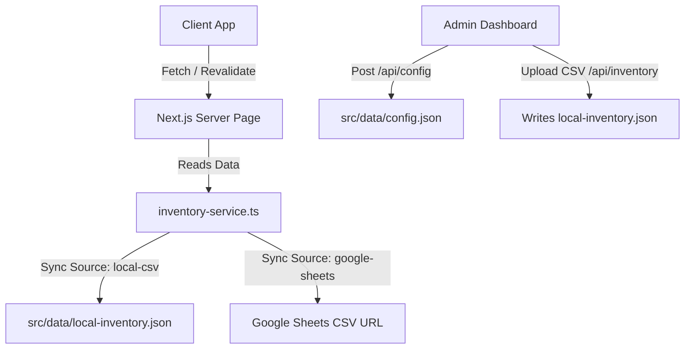
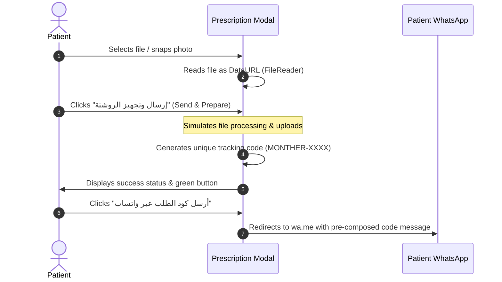

# 🏥 صيدلية المنذر | AlMonther Pharmacy

A high-performance, mobile-first full-stack Next.js web application tailored for pharmacy cataloging, prescription handling, and direct patient-to-pharmacist WhatsApp order routing. 

---

## 🚀 Key Features

* **⚡ Mobile-First Design**: Optimized specifically for smartphone viewports with sleek, bottom-aligned navigation tabs and high-fidelity scrolling.
* **✨ Hero Micro-Animation**: Interactive, 100/100 performance CSS/Framer Motion loop showcasing the scan-to-checkout sequence dynamically in a 3D perspective tilt container.
* **📦 Serverless / Database-less Architecture**: Completely runs without a SQL or NoSQL database. Config and inventory are saved in local JSON files or synced from Google Sheets.
* **📈 Google Sheets Integration**: Sync your pharmacy inventory in real time by connecting a public Google Sheet CSV export.
* **📥 Local POS CSV Ingestion**: Upload standard CSV inventory exports directly from physical pharmacy POS machines via the Admin Dashboard.
* **💬 WhatsApp Checkout Routing**: Instant click-to-chat messages populated with customer name, item details, price, and availability status.
* **📄 Interactive Prescription Uploader (الروشتة)**: Customers can snap a photo or upload their doctor's prescription, obtain a reference code, and submit it directly to the pharmacist.
* **🔒 Secure Admin Panel**: Edit pharmacy configurations (phone, hours, address) and trigger Incremental Static Regeneration (ISR) manually.

---

## 🎬 Hero Micro-Choreography Loop (`PrescriptionAnimation.tsx`)

To visually educate users on the prescription order process instantly on page load, a custom, database-free loop plays inside the Hero:

1. **Stage 1 (Floating Prescription)**: Displays an authentic Egyptian prescription layout scanned by a glowing, horizontal neon laser line (`#7DD3FC`).
2. **Stage 2 (Medication Match)**: Resolves the scan to reveal a matched medication product card (e.g. *Panadol Extra*) with a pulsing availability checkmark.
3. **Stage 3 (WhatsApp checkout)**: Drops down a high-converting WhatsApp interactive pill badge (*"احجز الآن عبر واتساب"*), showing the low-friction transaction flow.

The container supports 3D perspective tilting when hovered, adding depth and polish.

---

## 🛠️ Database-less Architecture (How It Works)

To maximize performance, reduce hosting costs, and simplify deployment, this application uses **flat-file data stores** combined with dynamic API endpoints:



### 1. Configuration (`src/data/config.json`)
Stores general settings including the active sync source, Google Sheet ID, phone numbers, and Arabic copywriting. This file is mutated securely by `/api/config`.

### 2. Local Inventory (`src/data/local-inventory.json`)
Stores the parsed items when importing locally from a POS CSV file. Mutated securely by `/api/inventory/upload`.

### 3. Google Sheets Sync
When set to `google-sheets`, the server fetches and parses public Google Sheet CSV streams on page render using Next.js ISR (Incremental Static Regeneration).

### 4. Incremental Static Regeneration (ISR)
The homepage uses `export const revalidate = 600;` (10 minutes) caching. When the admin edits data or uploads a CSV, a server-side route handler calls Next.js `revalidatePath("/")` to instantly regenerate the static page for all visitors.

---

## 📄 The Prescription Upload Workflow (الروشتة)

Patients in Egypt frequently order medicines by sharing images of their handwritten prescriptions (الروشتة). This application models that flow digitally:



1. **Upload Selection**: The customer clicks "إرسال روشتة" in the header. The file selector accepts image files or medical PDFs.
2. **Local Previewing**: Using the browser's `FileReader` API, the image is rendered locally on a canvas to provide visual confirmation.
3. **Simulated File Upload**: The file is parsed and queued. The modal simulates a secure file ingestion process, returning a custom tracking identifier: `MONTHER-[1000-9999]`.
4. **WhatsApp Dispatch**: The customer is prompted to click a button that opens a pre-populated message:
   > *"مرحباً صيدلية المنذر، لقد قمت برفع صورة الروشتة الروشتة الطبية الخاصة بي عبر الموقع الإلكتروني بنجاح. رمز الطلب المرجعي: MONTHER-5432..."*
   This connects the patient directly to the pharmacist's live chat with their unique reference code.

---

## 💻 Tech Stack

* **Core**: Next.js 16.2 (App Router)
* **Styling**: Tailwind CSS v4, Cairo Font (Google Fonts)
* **Animations**: Framer Motion
* **Utilities**: PapaParse (CSV parser), Lucide-react (Icons)

---

## ⚙️ Setup & Development

### 1. Install Dependencies
```bash
npm install
```

### 2. Run the Local Dev Server
```bash
npm run dev
```
Open [http://localhost:3000](http://localhost:3000) to view the client-facing application, and [http://localhost:3000/admin/upload](http://localhost:3000/admin/upload) to view the administration dashboard.

### 3. Build for Production
```bash
npm run build
```
The build process compiles all routes statically, optimizing assets and checking type safety.
